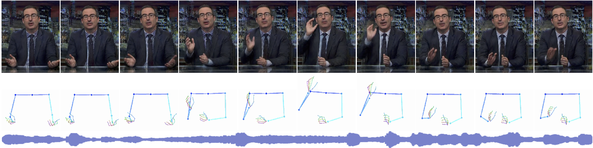
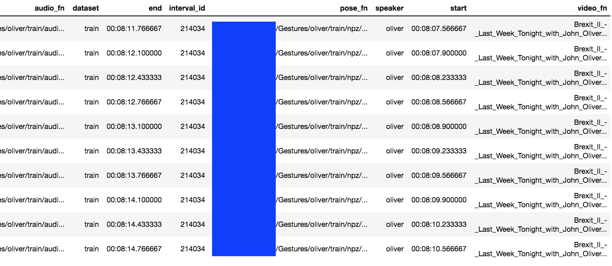

# Learning Individual Styles of Conversational Gestures
#### [Shiry Ginosar](http://people.eecs.berkeley.edu/~shiry)* , [Amir Bar](http://amirbar.net)* , Gefen Kohavi, [Caroline Chan](https://www.csail.mit.edu/person/caroline-chan), [Andrew Owens](http://andrewowens.com/), [Jitendra Malik](https://people.eecs.berkeley.edu/~malik/)

##### Back to [main project page](https://people.eecs.berkeley.edu/~shiry/projects/speech2gesture/index.html)

## Prerequisites:
1. `python 3.7.4`
2. `cuda 9.0`
3. `cuDNN v7.6.2`
4. `sudo apt-get install ffmpeg`
5. `pip install -r requirments.txt`
TODO: update this. 

## Data
1. Download the dataset as described [here](data/dataset.md)
- untar tar files in main folder 
- download video links (done once)
- download intervals (done once)
- download youtube: 
```
$ python -m data.download.download_youtube --base_path Gestures\ --speaker <speaker_name>
```

## Instructions
1. Extract training/validation data
2. Train a model
3. Perform inference using a trained model


### Extract training data
Start by extracting training data:
```
python -m data.train_test_data_extraction.extract_data_for_training --base_dataset_path <base_path> --speaker <speaker_name>
```
* Note I removed the NP argument from this command

```
once done you should see the following directories structure:
(notice train.csv and a train folder within the relevant speaker)

Gestures
├── frames.csv
├── train.csv
├── almaram
    ├── frames
    ├── videos
    ├── keypoints_all
    ├── keypoints_simple
    ├── videos
    └── train
...
└── shelly
    ├── frames
    ├── videos
    ├── keypoints_all
    ├── keypoints_simple
    ├── videos
    └── train
```

`train.csv` is a csv file in which every row represents a single training sample. Unlike in `frames.csv`, here,  a sample is few seconds long.  


#### Columns documentation:
```
audio_fn - path to audio filename associated with training sample
dataset - train/dev/test
start - start time in the video
end - end time in the video
pose_fn - path to .npz file containing training sample
speaker - name of a speaker in the dataset
video_fn - name of the video file
```


### Training a speaker specific model
Training run command example:
```
python -m audio_to_multiple_pose_gan.train --gans 1 --name test_run --arch_g audio_to_pose_gans --arch_d D_patchgan --speaker almaram --output_path feb24_model\ --train_csv Gestures\train.csv --epochs 1
```
During training, example outputs are saved in the define `output_path`
Differences between my version and the original project:
- I specify `D_patchgan` as `arch_d`
- I provide the path to the `train.csv` file
- I provide the number of epochs, because my machines are wee. 

### Inference
optionally get a pretrained model [here](https://drive.google.com/drive/folders/1qvvnfGwas8DUBrwD4DoBnvj8anjSLldZ). 
* Note: TF2 saves checkpoints in a different way than TF one. Therefore, an example performance inference on a random sample from validation set would go like: 

```
python -m audio_to_multiple_pose_gan.predict_to_videos --train_csv Gestures\train.csv --seq_len 64 --output_path feb24_inference\ --checkpoint feb24\audio_to_pose\test_run\2021-02-24--16-23-33-389317\best_ckpt-step_0_validation_loss_1.809.ckp --speaker almaram -ag audio_to_pose_gans --gans 1
```
In which the checkpoint path provides a folder which is actually a set of files.
Here it is helpful to have a naming convention. I use the date and output type. 

Perform inference on an audio sample:
```
python -m audio_to_multiple_pose_gan.predict_audio --audio_path <path_to_file.wav> --output_path </tmp/my_output_folder> --checkpoint <model checkpoint path> --speaker <speaker_name> -ag audio_to_pose_gans --gans 1

```

### Things I'm still worried about
- Worried about
(training steps)
- Cannot pickle generator object
- EOEError ran out of input 
- removed summary adding to class
- changing `:` to `_` in filepath names as windows doesn't like files with colons in the name. 
- manually changed a few folder locations 

### Reference
These guys are heroes. 
If you found this code useful, please cite the following paper:

```
@InProceedings{ginosar2019gestures,
  author={S. Ginosar and A. Bar and G. Kohavi and C. Chan and A. Owens and J. Malik},
  title = {Learning Individual Styles of Conversational Gesture},
  booktitle = {Computer Vision and Pattern Recognition (CVPR)}
  publisher = {IEEE},
  year={2019},
  month=jun
}
```

TODO: 
* syntacic/rhetorical parse to break up gestures 
* use phrase structure, motion, AND prosody?
* do semantic categorizing by hand
* look at stacy's stuff and see if we can intersect it
    * can we map caro analysis to subset of stacy analysis
    
Gestures as layering approach?????